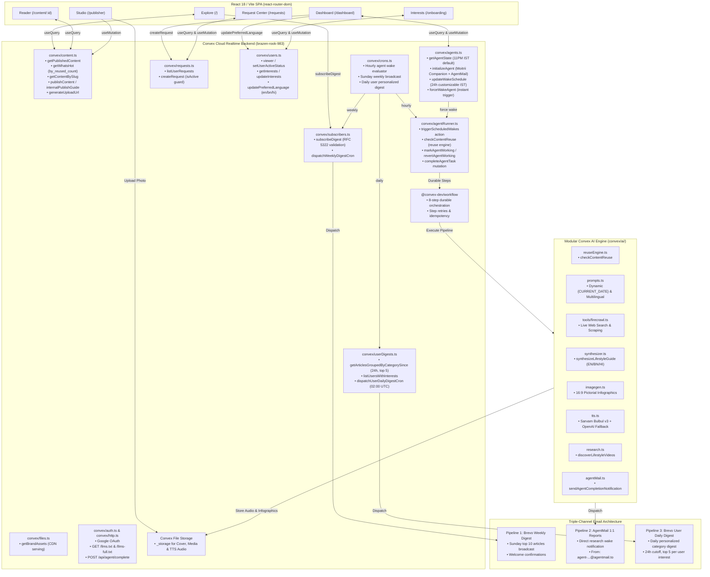

# Moitrii — Frontend & UI

> **Modern Indian Women's Lifestyle + Calm Technology**  
> An affordable personal AI agent platform built with **React 18 / Vite**, **React Router**, **Tailwind CSS**, and **Convex Cloud**.

---

## 🌸 Product Vision & Core Principle

Moitrii provides every woman with a dedicated, persistent personal AI agent that:
- Maintains context and interest preferences.
- Accepts natural-language requests at any time.
- Operates on a **sleeping agent model**: sleeps between cycles and periodically wakes according to the subscription tier to research, generate, or reuse content.
- Integrates with a **shared knowledge ecosystem** to deliver lifestyle insights while avoiding duplicate generation costs.

> **Core Principle:** All users receive identical agent capabilities; subscription tiers determine only execution frequency (wake periodicity).

---

## 🎨 UI Theme & Design System

Moitrii avoids generic dark/cold SaaS styling in favor of a warm, editorial lifestyle magazine aesthetic:

- **Color Palette:**
  - **Background:** Warm off-white / soft cream (`#FDFBF7` / `#FAF7F2`)
  - **Primary Text:** Deep charcoal / near-black (`#1A1A1A` / `#2D2D2D`)
  - **Accents:** Muted Sage (`#7C9082`), Terracotta (`#C86D51`), Dusty Rose (`#C48B8B`), Warm Beige (`#E6DEC8`)
  - *No harsh neon or dominant hot pink.*
- **Typography & Mood:** Editorial serif headers, clean sans-serif body, generous whitespace, warm lifestyle imagery, and calm transitions.
- **Calm Technology:** AI is presented as a helpful, subtle companion rather than an intrusive chatbot.

---

## 📱 Core UI Screens & User Journeys

### 1. Public Landing & Exploration (`/` or `/explore`)
- **Editorial Header & Navigation:** Categories (Health, Food, Beauty, Wellness, Kids, Home, Travel, Gen-Z, Anime).
- **Hero Banner:** Editorial lifestyle hero with core value proposition.
- **What's Hot:** Curated carousel/grid of top lifestyle stories backed by index `by_reused_count`.
- **Popular Categories:** Interactive exploration pills.
- **Latest Stories & Shared Library:** Browse published articles with reuse badges.
- **Trending Videos:** Curated YouTube video cards and embeds.
- **Weekly Lifestyle Digest Subscription:** Email newsletter subscription input in footer with RFC 5322 validation and deduplication.
- **About Moitrii:** Mission and platform philosophy footer.

### 2. Onboarding & Interest Selection (`/onboarding`)
- Interactive topic grid for first-time setup:
  - *Core Lifestyle:* Health, Cooking, Beauty/Makeup, Yoga/Fitness, Wellness, Kids & Education, Home, Travel.
  - *Parent & Youth Culture:* Gen-Z trends, Anime, Comics.
- Selections persisted directly to user profile via Convex mutations.

### 3. Agent Dashboard (`/dashboard`)
- **Agent Status Indicator:** Visual state badge (`SLEEPING`, `ACTIVE`, `WORKING`, `WAITING`, `ERROR`) with calm pulsing indicator.
- **Wake Schedule Card:** Configurable schedule defaulting to **11:00 PM IST** (customizable to any 24h time in IST) and countdown to next cycle.
- **Preferred Language Selector:** Warm editorial segmented pill control for **English** (`EN`), **বাংলা** (`BN`), and **हिन्दी** (`HI`) with localized synthesis micro-copy.
- **Quick Request Input:** Natural language prompt box ("What would you like your agent to work on?").
- **Followed Topics:** Quick filter tags for active subscriptions.
- **Agent Work Feed:**
  - *Completed Deliverables:* Ready-to-read cards with links.
  - *Queued / Processing Requests:* Status tracker for next wake-up.

### 4. Request Center & History (`/requests`)
- Submit requests at any time (persisted durably even while agent sleeps).
- Realtime request lifecycle tracking:
  `PENDING` ➔ `PROCESSING` ➔ `COMPLETED` / `FAILED`
- Request details: submission timestamp, processing window, content reuse vs. generated status, delivery logs.

### 5. Content & Article Reader View (`/content/:id`)
- Editorial layout for generated and reused content.
- **In-Article Audio Narration Player:** Interactive audio playback bar positioned directly below the headline (disabled state if narration is unavailable).
- **Author Transparency & AI Disclaimer:** Distinct author badges (`AI Agent Companion` vs `Human Author`) and editorial synthetic content disclaimer banner.
- Integrated media: AI-generated visual headers, embedded YouTube players, structured key takeaways, and source citations.
- Related content recommendations from the shared knowledge base.
- Shareable public links.

### 6. Publisher Studio (`/publisher`)
- Authoring and drafting tools for verified publishers.
- Rich content preview (markdown, image/video embeds, audio narration URL).
- Single-click publish with automatic slug sanitization and duplicate collision handling.

---

## ⚡ Convex Integration & Realtime Architecture

Documentation for this project lives at [`docs/`](docs/index.mdx) (preview locally with `docs7 dev docs --port 3333`).



### Convex Function & Subsystem Responsibilities
- **`convex/content.ts`:**
  - `getPublishedContent(category?, limit?)`: Realtime listing with category projections (capped at 50).
  - `getWhatsHot(limit?)`: Trending articles querying `.index("by_reused_count")` in descending order.
  - `getContentBySlug(slug)`: Full markdown guide, key takeaways, and companion media for `/content/[id]`.
  - `publishContent(...)`: Secure mutation with slug sanitization, collision deduplication, audio metadata, and author type.
  - `internalPublishGuide(...)`: Internal mutation used by AI agent pipeline to atomically publish research deliverables.
  - `checkContentReuse(prompt, category)`: Full-text search and keyword similarity engine for knowledge reuse.
  - `generateUploadUrl()`: Upload URL generator for direct image uploads to Convex File Storage.
- **`convex/agents.ts`:**
  - `getAgentState()`: Persistent personal agent state query with 11:00 PM IST auto-initialization.
  - `initializeAgent(wakeFrequency?, subscriptionTier?)`: Ensures an agent record exists with companion AgentMail address (`moitrii@agentmail.to` on free tier; scaling roadmap provisions 1 address per user) and persona name `"Moitrii Companion"`.
  - `updateWakeSchedule(wakeTimeOfDay, timezone?)`: Mutation updating agent wake schedule to any valid 24h time in IST.
- **`convex/agentRunner.ts` & `convex/crons.ts`:**
  - `triggerScheduledWakes()`: Hourly cron-triggered action querying due agents (filtering active users), executing the 8-step durable AI workflow with automatic rollback on failure:
    1. Content Reuse Check (`checkContentReuse` → `reuseEngine.ts`) — matches prompt against existing guides; on reuse, increments `reusedCount` (the shared social knowledge signal)
    2. Live Web Research (`firecrawlSearchTool` in `convex/ai/tools/`)
    3. Multilingual Synthesis (`synthesizeLifestyleGuide` in EN/BN/HI using dynamic `{CURRENT_DATE}` prompts)
    4. 16:9 Horizontal Infographic Poster Generation (`generateInfographicCover` in `imagegen.ts` → Convex `_storage`)
    5. Audio Narration (`generateAndStoreAudioNarration` with Sarvam Bulbul v3 primary + OpenAI fallback → Convex `_storage`)
    6. Video Discovery (`discoverLifestyleVideos` → YouTube embed linking)
    7. Atomic Publish (`internalPublishGuide` → shared knowledge library)
    8. AgentMail Notification (`sendAgentCompletionNotification` from `agent-...@agentmail.to`)
  - `markAgentWorking` / `revertAgentWorking` / `completeAgentTask`: State transitions for the dispatch window (60 min, `DISPATCH_WINDOW_MINUTES`). On pipeline error, agent reverts to `SLEEPING` and requests return to `PENDING` for the next cycle.
  - Dispatch logic: `crons.hourly` runs with automatic off-peak spreading away from top-of-the-hour; `isWakeDue` checks if the agent's configured `wakeTimeOfDay` falls in the elapsed 60-minute window. Also supports immediate execution via `forceWakeAgent` (`force: true`).
- **`convex/requests.ts`:**
  - `listUserRequests()`: Realtime query of user's research requests sorted chronologically.
  - `createRequest(prompt, category?)`: Mutation queueing research tasks (blocked if user `isActive: false`).
- **`convex/users.ts`:**
  - `viewer()`: Authenticated Google user profile resolution with default `"en"` language.
  - `setUserActiveStatus(userId, isActive)`: Internal moderation mutation for dispute safety.
  - `getInterests()` & `updateInterests(topicIds)`: User topic preferences.
  - `updatePreferredLanguage(language)`: Sets preferred synthesis language (`en`, `bn`, `hi`).
- **`convex/subscribers.ts`:**
  - `subscribeDigest(email, source?, preferredLanguage?)`: Public/authenticated newsletter subscription with RFC 5322 validation, idempotent reactivation of unsubscribed records, and Brevo welcome email trigger.
  - `unsubscribeDigest(email)`: One-click unsubscribe mutation that transitions subscriber status to `UNSUBSCRIBED` and records `unsubscribedAt`.
  - `getSubscriberStatus(email)`: Query returning subscription status for `/unsubscribe` and UI components.
  - `listActiveSubscribers()`: Internal query returning all active subscriber emails.
  - `getTopWeeklyDigestArticles()`: Internal query retrieving the top 10 published guides ordered by `reusedCount` (descending) without spending LLM tokens.
  - `dispatchWeeklyDigestCron()`: Internal action triggered by Sunday cron to broadcast the top 10 digest via Brevo.
- **`convex/userDigests.ts`:**
  - `getArticlesGroupedByCategorySince(cutoffIso)`: Internal query gathering articles published within the last 24h, grouping by canonical category and capping at strictly top 5 per category.
  - `listUsersWithInterests()`: Internal query retrieving all active users paired with their configured topic interest IDs (`topicIds`).
  - `dispatchUserDailyDigestCron(force?)`: Daily morning cron (02:00 UTC / 07:30 AM IST) evaluating users, filtering 24h articles matching their interests, and dispatching personalized digests via Brevo.
  - `triggerUserDailyDigestManual(force?)`: Manual test action for executing personalized daily digests on demand.
- **`convex/emails/brevo.ts`:**
  - `sendSubscriberWelcomeEmail(email, apiKey?, baseUrl?)`: Transactional welcome confirmation via Brevo REST API with one-click unsubscribe footer link.
  - `sendWeeklyDigestBroadcast(subscriberEmails, articles, apiKey?, baseUrl?)`: Weekly top 10 broadcast newsletter to all active subscribers with direct links, read times, takeaways, and personalized unsubscribe links.
  - `sendUserDailyDigestEmail(userEmail, userName, categoriesWithArticles, apiKey?, baseUrl?)`: Daily personalized category digest with up to top 5 articles per subscribed interest published in the last 24 hours.
  - Zero-LLM rendering pipeline utilizing existing database content and stored takeaways.
  - Link origin resolution: explicit `baseUrl` argument → `APP_ORIGIN` environment variable → `https://moitrii.ai` fallback. Set `APP_ORIGIN` (e.g. your deployment or `http://localhost:3000` for demos) so email links resolve.
  - Sender resolution: `BREVO_SENDER_EMAIL` environment variable → `newsletter@moitrii.ai` fallback. The address must be a verified sender in the Brevo dashboard (`Senders & IP → Senders`).
- **`convex/ai/` Modular AI Engine:**
  - `reuseEngine.ts`: Full-text search match score against existing published guides for cost reduction.
  - `prompts.ts`: Dynamic system prompt builder injecting `{CURRENT_DATE}` (in `Asia/Kolkata` IST timezone) and language-specific tone directives.
  - `tools/firecrawl.ts`: Convex AI Agent live web search and deep-scraping tool.
  - `synthesizer.ts`: Multilingual editorial guide synthesis (`gpt-5.6-luna` with JSON mode in English, Bengali, Hindi) with citations and structured takeaways.
  - `imagegen.ts`: 16:9 horizontal pictorial infographic poster generation (`gpt-image-1`, `1536x1024`, `quality: "low"`, `output_format: "webp"`, `output_compression: 80`) with strict no-text and zero-vulgarity rules.
  - `tts.ts`: Sarvam AI Bulbul v3 (`bulbul:v3`) female voice (`speaker: "ritu"`) primary TTS (2 attempts) + OpenAI `tts-1` fallback + offline WAV fallback stored in Convex `_storage`.
  - `research.ts`: Relevant YouTube video discovery and embed linking.
  - `agentMail.ts`: HTML formatted research report dispatch from `agent.email` to user.
- **`convex/files.ts`:**
  - `getBrandAssets()`: Serves dynamic Convex CDN URLs for logo and hero images.
- **`convex/auth.ts` & `convex/http.ts`:**
  - Google OAuth routes, GET `/llms.txt` and `/llms-full.txt` standard-compliant AI crawler endpoints, and `POST /api/agent/complete` with fail-closed token authorization.

---

## 🌐 Social & Community Features

- **Shared Knowledge Library:** All published guides are available for reuse by any agent across the platform — building a collective, growing content library that reduces duplicate generation costs.
- **Reuse-Powered Rankings:** The "What's Hot" carousel on the landing page ranks by `reusedCount`, surfacing the most-reused lifestyle guides community-wide.
- **Transparent Reuse Reporting:** Request history distinguishes **"Shared Knowledge Reuse"** (matched existing guide, `reusedCount` incremented) from **"Freshly Researched & Synthesized"** (novel generation).
- **PII-Safe Agent Identity:** Every agent has a distinct virtual inbox (`agent-<userId>@agentmail.to`) and a persona name (`Moitii Companion`) — zero human PII stored in the `agents` table.

1. **Strict PII Anonymization Policy:**
   - Real user names and personal email addresses exist **exclusively in the `users` table**.
   - The `agents` table stores persona names (`"Moitrii Companion"`) and companion AgentMail address (`moitrii@agentmail.to` on free tier; scaling roadmap provisions 1 virtual address per user).
   - Downstream tables (`requests`, `content`, `userInterests`) reference only opaque `userId: v.id("users")`.

2. **Dispute & Moderation Safety:**
   - `users.isActive` defaults to `true`. If set to `false`, agent wake evaluation, request creation, and profile modifications are blocked immediately.
3. **Dual-Channel Separation:**
   - **Brevo:** Used exclusively for platform newsletter digests and welcome notifications.
   - **AgentMail:** Used exclusively for 1:1 personal AI agent research deliverables.


---

## 🔒 Operating Guidelines

- **Token Efficiency:** Concise and targeted development.
- **Git Restrictions:** Only `git status` permitted; commits and pushes are reserved for the developer.
- **Subagents:** No subagents spawned without explicit approval.
- **Security:** Zero inspection of `.env*` files or system environment variables.


# UI page structure

UI pages:
1. Public landing page
---------------------------------------------
MOITRII
────────────────────────────────────────────
Health  Food  Beauty  Wellness  Kids  Home  Travel

        [ Large editorial hero image ]

        Healthy living, beautiful homes,
        family, wellness & everyday life

        Explore what's relevant to you →

────────────────────────────────────────────

What's Hot
[ Large card ] [ Card ] [ Card ]

Popular Categories
[ Health ] [ Cooking ] [ Beauty ] [ Yoga ]
[ Kids ]   [ Home ]    [ Travel ]

Latest Stories
[ Article ] [ Article ] [ Article ]

Trending Videos
[ Video ] [ Video ] [ Video ]

────────────────────────────────────────────
              About Moitrii


2.After login — Agent-centric

Once the user signs in, the experience changes:

Moitrii
────────────────────────────────────
My Agent     Explore     My Content

Good morning, Priya

Your agent is sleeping.
Next wake-up: Tomorrow 08:00

┌──────────────────────────────────┐
│ What would you like your agent   │
│ to work on?                  →   │
└──────────────────────────────────┘

Your Interests
Health · Cooking · Kids · Travel

Your Agent's Work
────────────────────────────────────
✦ Healthy homemade drinks
  Ready to read →

✦ Weekend trip ideas
  Researching next wake-up

---

## 🏛️ Architectural Decisions: Article Body & Media Storage

### Database Document (`content: v.string()`) vs. File Storage (`_storage`)

| Consideration | Database Document (`content: v.string()`) [SELECTED] | File Storage (`_storage` file) |
| :--- | :--- | :--- |
| **Reader Latency & UX** | ⚡ **Instant (1 Hop):** Single reactive query loads metadata + full article body with zero waterfall lag. | ⏳ **Waterfall (2 Hops):** Requires querying metadata, then firing a 2nd client HTTP fetch to download text blob. |
| **Searchability & Reuse** | 🔍 **Native Full-Text Search:** Direct Convex `.searchIndex("search_content", { searchField: "content" })` enables instant matching for AI content reuse. | ❌ **No Direct Search:** Convex search indexes cannot index binary files in File Storage. |
| **Publishing / Agent Action** | ✍️ **1-Step Atomic Transaction:** Single database mutation writes title, takeaways, photos, and markdown atomically. | 🔄 **Multi-Step Flow:** Generate upload URL $\rightarrow$ HTTP POST blob $\rightarrow$ get `storageId` $\rightarrow$ insert document (risk of orphaned blobs). |
| **Capacity & Economics** | A typical 2,000-word article is **~8 KB**, utilizing <1% of the **1 MB Convex document limit**. | Unlimited storage; ideal for multi-megabyte PDFs, audio, or video binaries. |
| **Payload Optimization** | **List Projections:** Landing page queries fetch only card metadata (`title`, `slug`, `subtitle`, `coverImage`), keeping grid payloads lightweight. | Separate files, but introduces network roundtrips. |

### Decision Summary
- **Binary Photos & Uploads:** Use **Convex File Storage (`_storage`)** or optimized CDN URLs for cover images.
- **Article Markdown Body & Key Takeaways:** Store directly in the **Convex Database Document (`content: v.string()`)** for instant loading, full-text search indexing, and atomic agent deliverables.

---

## 🛠️ Development & Build Commands

```bash
# Install dependencies
npm install

# Start Vite React dev server (http://localhost:3000)
npm run dev

# Run Convex Cloud backend dev watcher
npx convex dev

# Typecheck and build production SPA (outputs to dist/)
npm run build

# Preview production build locally
npm run preview

# Run two-tier Vitest test suite (UI + Convex tests)
npm test

# checking documentation with docs7
docs7 dev docs --port 3333
```

---

## 🧪 Manual Testing: Weekly Digest & Unsubscribe

### 1. Brevo Setup (free tier = 300 emails/day)

In the [Brevo dashboard](https://app.brevo.com):

1. **SMTP & API → API Keys → Generate new key (v3)** — copy the `xkeysib-...` key.
2. **Senders & IP → Senders → Add a Sender** — enter an email you own (your Gmail is fine) and click the verification link Brevo emails you. Brevo rejects sends from unverified addresses.

### 2. Environment Variables

#### For Development (Local Testing):
```bash
npx convex env set BREVO_API_KEY xkeysib-your-key-here
npx convex env set BREVO_SENDER_EMAIL your-verified-address@gmail.com
npx convex env set AGENTMAIL_API_KEY your-agentmail-key-here
npx convex env set OPENAI_API_KEY sk-proj-your-key-here
npx convex env set SARVAM_API_KEY your-sarvam-key-here
npx convex env set FIRECRAWL_API_KEY fc-your-key-here
npx convex env set APP_ORIGIN http://localhost:3000
```

#### For Production (Cloudflare Pages + Convex Prod):
```bash
npx convex env set --prod BREVO_API_KEY xkeysib-your-key-here
npx convex env set --prod BREVO_SENDER_EMAIL your-verified-address@gmail.com
npx convex env set --prod AGENTMAIL_API_KEY your-agentmail-key-here
npx convex env set --prod OPENAI_API_KEY sk-proj-your-key-here
npx convex env set --prod SARVAM_API_KEY your-sarvam-key-here
npx convex env set --prod FIRECRAWL_API_KEY fc-your-key-here
npx convex env set --prod APP_ORIGIN https://moitrii-frontend.pages.dev
```


Then restart `npx convex dev` so running functions pick up the new values. Without `BREVO_API_KEY` the pipeline runs in demo mode: nothing is sent, delivery is only logged.

### 3. Prerequisites for a Digest Run

- At least one **ACTIVE subscriber** — subscribe with your own email via the site footer.
- At least one row in the `content` table — publish one via the Publisher page (the dispatcher skips with `No published articles found` otherwise).

### 4. Trigger Instant Agent Wake, Sunday Digest, or Daily User Digest
 
To trigger the immediate wake of due/pending user requests:
- **Bash / PowerShell:**
  ```bash
  npx convex run agentRunner:triggerScheduledWakes '{"force":true}'
  ```
- **Windows DOS Command Prompt (`cmd.exe`):**
  ```cmd
  npx convex run agentRunner:triggerScheduledWakes "{\"force\":true}"
  ```

To run the weekly newsletter digest broadcast directly:
```bash
npx convex run subscribers:dispatchWeeklyDigestCron
```

To run the daily personalized category user digest directly:
- **Bash / PowerShell:**
  ```bash
  npx convex run userDigests:triggerUserDailyDigestManual '{"force":true}'
  ```
- **Windows DOS Command Prompt (`cmd.exe`):**
  ```cmd
  npx convex run userDigests:triggerUserDailyDigestManual "{\"force\":true}"
  ```

To test standard-compliant `llms.txt` crawler endpoints:
```bash
curl http://localhost:3000/llms.txt
curl http://localhost:3000/llms-full.txt
```

Alternatively, exercise the real cron wiring: temporarily register an interval cron in `convex/crons.ts` while `npx convex dev` is running, watch it fire in the dashboard logs, then remove it:

```ts
crons.interval(
  "test-digest-every-minute",
  { seconds: 60 },
  internal.subscribers.dispatchWeeklyDigestCron,
  {}
);
```

### 5. Verify the Full Loop

1. The email arrives from your verified sender with ranked top 10 cards and `/content/[slug]` links pointing at `APP_ORIGIN`.
2. Click **Unsubscribe from weekly digest** (with `npm run dev` running) — the page confirms unsubscription.
3. Confirm the status flip from the CLI:
   - **Bash / PowerShell:**
     ```bash
     npx convex run subscribers:getSubscriberStatus '{"email":"your-email@gmail.com"}'
     ```
   - **Windows DOS Command Prompt (`cmd.exe`):**
     ```cmd
     npx convex run subscribers:getSubscriberStatus "{\"email\":\"your-email@gmail.com\"}"
     ```
   → `{ isSubscribed: false, status: "UNSUBSCRIBED" }`
4. Click **resubscribe** on the page — the same command returns `ACTIVE`, and a re-run of the dispatcher proves unsubscribed addresses are skipped.

For a zero-cost template check before any of this, `npx vitest run convex/emails/brevo.test.ts` renders the digest HTML offline (no keys, no sending).

---

## ❓ FAQ

### How is authentication handled in the pure React SPA?

Authentication is powered by `@convex-dev/auth/react`. The app root is wrapped in `ConvexAuthProvider` reading `VITE_CONVEX_URL`. Protected routes (`/dashboard`, `/requests`, `/onboarding`, `/publisher`) use the `AuthGuard` component, while public routes (`/`, `/explore`, `/content/:id`) render immediately without blocking unauthenticated visitors.

### `npm install` deletes dev dependencies (`vitest`, `tailwindcss`, `typescript` disappear)

**Cause:** npm is configured with `omit=dev`, which it inherits automatically if a global `NODE_ENV=production` is set in the system environment.

**Fix:** Install with dev dependencies explicitly included:

```bash
npm install --include=dev
```

### Why do images fail with `net::ERR_FILE_NOT_FOUND` on reload?

**Cause:** Ephemeral `blob:http://...` strings from `URL.createObjectURL(file)` expire on page refresh or session restart.

**Invariant:** Upload files to Convex File Storage (`_storage`) and store `coverImageStorageId`. Query endpoints (`getContentBySlug`, `getPublishedContent`, `getWhatsHot`) dynamically resolve permanent CDN URLs via `ctx.storage.getUrl(storageId)`. Frontend images implement `onError` fallbacks to `/images/moitrii.jpg`.

### Why do embedded YouTube videos fail with "Video unavailable"?

**Cause:** Iframe players require an exact 11-character video ID, but users/publishers often provide full watch URLs (`youtube.com/watch?v=...`) or shortlinks (`youtu.be/...`).

**Invariant:** Always route video parameters through `extractYouTubeId()` (`src/lib/youtube.ts`) before constructing embed iframes, safely omitting or disabling invalid players.

### Why does refreshing a subroute on Cloudflare Pages return 404?

**Cause:** React Router manages routing in the browser. When refreshing or typing deep links like `/dashboard` or `/content/:slug`, Cloudflare Pages searches for a static file named `/dashboard.html` which does not exist in a Vite SPA.

**Fix:** A `public/_redirects` file contains `/* /index.html 200`. Vite automatically includes this in `dist/`, instructing Cloudflare Pages to serve `index.html` with status 200 for all client-side routes.

### How do I run and write tests?

Tests run across two projects under `vitest.config.ts`:
- **UI Tests (`src/**/*.test.tsx`):** JSDOM environment with mocked Convex and Auth hooks.
- **Convex Tests (`convex/**/*.test.ts`):** Edge runtime with `convex-test` against an in-memory database.

```bash
npm test
```

### How are Audio Summaries and Infographic Covers generated?

- **Audio Summaries (`convex/ai/tts.ts`):** Synthesized using Sarvam AI Bulbul v3 (`bulbul:v3`) with female speaker `"ritu"` and natural Indic prosody and pacing (2 retry attempts). Automatically falls back to OpenAI `tts-1` (`alloy` voice) or an offline 44-byte silent WAV storage fallback if external APIs fail.
- **Infographic Cover Images (`convex/ai/imagegen.ts`):** Generates 16:9 horizontal landscape (`1536x1024`, `quality: "low"`, `output_format: "webp"`, `output_compression: 80`) visual infographics via `gpt-image-1` enforcing **strictly no text, words, or typography** (with subtle `"Moitrii"` watermark exception) and family-safe zero-vulgarity ethics. Uploads to Convex File Storage (`_storage`) as WebP with fallback to curated high-resolution category imagery.

---

## 📖 Complete Documentation & Manual Testing Guide

Full interactive documentation is powered by **docs7**:
- **Preview Docs Locally:** `docs7 dev docs --port 3333`
- **End-to-End Testing Guide:** See [`docs/manual-testing.mdx`](docs/manual-testing.mdx) for step-by-step verification instructions covering Agent Force Wake, Request Lifecycle, Multi-Language Audio/Infographics, and Brevo Digests.


