# Moitrii — Frontend & UI

> **Modern Indian Women's Lifestyle + Calm Technology**  
> An affordable personal AI agent platform built with **React / Next.js**, **Tailwind CSS**, and **Convex Cloud**.

---

## 🌸 Product Vision & Core Principle

Moitrii provides every woman with a dedicated, persistent personal AI agent that:
- Maintains context and interest preferences.
- Accepts natural-language requests at any time.
- Operates on a **sleeping agent model**: sleeps between cycles and periodically wakes according to the subscription tier to research, generate, or reuse content.
- Integrates with a **shared knowledge ecosystem** to deliver lifestyle insights while avoiding duplicate generation costs.

> **Core Principle:** All users receive identical agent capabilities; subscription tiers determine only execution frequency (wake periodicity).

---

## 🎨 UI Theme & Design System

Moitrii avoids generic dark/cold SaaS styling in favor of a warm, editorial lifestyle magazine aesthetic:

- **Color Palette:**
  - **Background:** Warm off-white / soft cream (`#FDFBF7` / `#FAF7F2`)
  - **Primary Text:** Deep charcoal / near-black (`#1A1A1A` / `#2D2D2D`)
  - **Accents:** Muted Sage (`#7C9082`), Terracotta (`#C86D51`), Dusty Rose (`#C48B8B`), Warm Beige (`#E6DEC8`)
  - *No harsh neon or dominant hot pink.*
- **Typography & Mood:** Editorial serif headers, clean sans-serif body, generous whitespace, warm lifestyle imagery, and calm transitions.
- **Calm Technology:** AI is presented as a helpful, subtle companion rather than an intrusive chatbot.

---

## 📱 Core UI Screens & User Journeys

### 1. Public Landing & Exploration (`/` or `/explore`)
- **Editorial Header & Navigation:** Categories (Health, Food, Beauty, Wellness, Kids, Home, Travel, Gen-Z, Anime).
- **Hero Banner:** Editorial lifestyle hero with core value proposition.
- **What's Hot:** Curated carousel/grid of top lifestyle stories.
- **Popular Categories:** Interactive exploration pills.
- **Latest Stories & Shared Library:** Browse published articles with reuse badges.
- **Trending Videos:** Curated YouTube video cards and embeds.
- **About Moitrii:** Mission and platform philosophy footer.

### 2. Onboarding & Interest Selection (`/onboarding`)
- Interactive topic grid for first-time setup:
  - *Core Lifestyle:* Health, Cooking, Beauty/Makeup, Yoga/Fitness, Wellness, Kids & Education, Home, Travel.
  - *Parent & Youth Culture:* Gen-Z trends, Anime, Comics.
- Selections persisted directly to user profile via Convex mutations.

### 3. Agent Dashboard (`/dashboard`)
- **Agent Status Indicator:** Visual state badge (`SLEEPING`, `ACTIVE`, `WORKING`, `WAITING`, `ERROR`) with calm pulsing indicator.
- **Wake Schedule Card:** Countdown to the next scheduled wake-up cycle and last active summary.
- **Quick Request Input:** Natural language prompt box ("What would you like your agent to work on?").
- **Followed Topics:** Quick filter tags for active subscriptions.
- **Agent Work Feed:**
  - *Completed Deliverables:* Ready-to-read cards with links.
  - *Queued / Processing Requests:* Status tracker for next wake-up.

### 4. Request Center & History (`/requests`)
- Submit requests at any time (persisted durably even while agent sleeps).
- Realtime request lifecycle tracking:
  `PENDING` ➔ `PROCESSING` ➔ `COMPLETED` / `FAILED`
- Request details: submission timestamp, processing window, content reuse vs. generated status, delivery logs.

### 5. Content & Article Reader View (`/content/[id]`)
- Editorial layout for generated and reused content.
- Integrated media: AI-generated visual headers, embedded YouTube players, structured key takeaways, and source citations.
- Related content recommendations from the shared knowledge base.
- Shareable public links.

### 6. Publisher Studio (`/publisher`)
- Authoring and drafting tools for verified publishers.
- Rich content preview (markdown, image/video embeds).
- Single-click publish to the Moitrii Shared Knowledge Ecosystem.

---

## ⚡ Convex Integration & Architecture

```mermaid
flowchart LR
    subgraph Frontend ["Next.js / React UI"]
        UI_Home["Landing & Explore"]
        UI_Dash["Agent Dashboard"]
        UI_Req["Request Center"]
        UI_Reader["Content Reader"]
    end

    subgraph Convex ["Convex Realtime Backend"]
        Q_Agent["api.agents.getAgentState"]
        Q_Req["api.requests.listUserRequests"]
        Q_Content["api.content.getPublishedContent"]
        M_Req["api.requests.createRequest"]
        M_User["api.users.updateInterests"]
    end

    Frontend <-->|"Convex React Client"| Convex
```

- **Queries:** Realtime subscriptions to agent state, request queue status, published articles, and user profile.
- **Mutations:** Immediate, optimistic updates for request creation and interest preferences.

---

## 🔒 Operating Guidelines

- **Token Efficiency:** Concise and targeted development.
- **Git Restrictions:** Only `git status` permitted; commits and pushes are reserved for the developer.
- **Subagents:** No subagents spawned without explicit approval.
- **Security:** Zero inspection of `.env*` files or system environment variables.

# UI page structure

UI pages:
1. Public landing page
---------------------------------------------
MOITRII
────────────────────────────────────────────
Health  Food  Beauty  Wellness  Kids  Home  Travel

        [ Large editorial hero image ]

        Healthy living, beautiful homes,
        family, wellness & everyday life

        Explore what's relevant to you →

────────────────────────────────────────────

What's Hot
[ Large card ] [ Card ] [ Card ]

Popular Categories
[ Health ] [ Cooking ] [ Beauty ] [ Yoga ]
[ Kids ]   [ Home ]    [ Travel ]

Latest Stories
[ Article ] [ Article ] [ Article ]

Trending Videos
[ Video ] [ Video ] [ Video ]

────────────────────────────────────────────
              About Moitrii

2.After login — Agent-centric

Once the user signs in, the experience changes:

Moitrii
────────────────────────────────────
My Agent     Explore     My Content

Good morning, Priya

Your agent is sleeping.
Next wake-up: Tomorrow 08:00

┌──────────────────────────────────┐
│ What would you like your agent   │
│ to work on?                  →   │
└──────────────────────────────────┘

Your Interests
Health · Cooking · Kids · Travel

Your Agent's Work
────────────────────────────────────
✦ Healthy homemade drinks
  Ready to read →

✦ Weekend trip ideas
  Researching next wake-up
