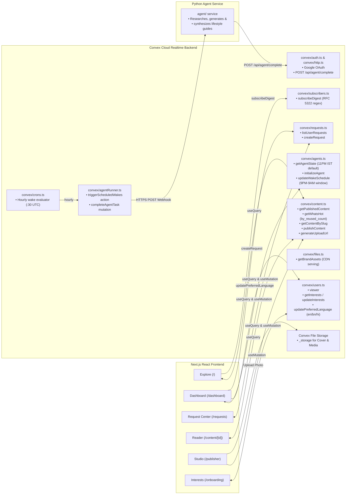

# Moitrii — Frontend & UI

> **Modern Indian Women's Lifestyle + Calm Technology**  
> An affordable personal AI agent platform built with **React / Next.js**, **Tailwind CSS**, and **Convex Cloud**.

---

## 🌸 Product Vision & Core Principle

Moitrii provides every woman with a dedicated, persistent personal AI agent that:
- Maintains context and interest preferences.
- Accepts natural-language requests at any time.
- Operates on a **sleeping agent model**: sleeps between cycles and periodically wakes according to the subscription tier to research, generate, or reuse content.
- Integrates with a **shared knowledge ecosystem** to deliver lifestyle insights while avoiding duplicate generation costs.

> **Core Principle:** All users receive identical agent capabilities; subscription tiers determine only execution frequency (wake periodicity).

---

## 🎨 UI Theme & Design System

Moitrii avoids generic dark/cold SaaS styling in favor of a warm, editorial lifestyle magazine aesthetic:

- **Color Palette:**
  - **Background:** Warm off-white / soft cream (`#FDFBF7` / `#FAF7F2`)
  - **Primary Text:** Deep charcoal / near-black (`#1A1A1A` / `#2D2D2D`)
  - **Accents:** Muted Sage (`#7C9082`), Terracotta (`#C86D51`), Dusty Rose (`#C48B8B`), Warm Beige (`#E6DEC8`)
  - *No harsh neon or dominant hot pink.*
- **Typography & Mood:** Editorial serif headers, clean sans-serif body, generous whitespace, warm lifestyle imagery, and calm transitions.
- **Calm Technology:** AI is presented as a helpful, subtle companion rather than an intrusive chatbot.

---

## 📱 Core UI Screens & User Journeys

### 1. Public Landing & Exploration (`/` or `/explore`)
- **Editorial Header & Navigation:** Categories (Health, Food, Beauty, Wellness, Kids, Home, Travel, Gen-Z, Anime).
- **Hero Banner:** Editorial lifestyle hero with core value proposition.
- **What's Hot:** Curated carousel/grid of top lifestyle stories backed by index `by_reused_count`.
- **Popular Categories:** Interactive exploration pills.
- **Latest Stories & Shared Library:** Browse published articles with reuse badges.
- **Trending Videos:** Curated YouTube video cards and embeds.
- **Weekly Lifestyle Digest Subscription:** Email newsletter subscription input in footer with RFC 5322 validation and deduplication.
- **About Moitrii:** Mission and platform philosophy footer.

### 2. Onboarding & Interest Selection (`/onboarding`)
- Interactive topic grid for first-time setup:
  - *Core Lifestyle:* Health, Cooking, Beauty/Makeup, Yoga/Fitness, Wellness, Kids & Education, Home, Travel.
  - *Parent & Youth Culture:* Gen-Z trends, Anime, Comics.
- Selections persisted directly to user profile via Convex mutations.

### 3. Agent Dashboard (`/dashboard`)
- **Agent Status Indicator:** Visual state badge (`SLEEPING`, `ACTIVE`, `WORKING`, `WAITING`, `ERROR`) with calm pulsing indicator.
- **Wake Schedule Card:** Configurable schedule defaulting to **11:00 PM IST** with night-window restriction (9:00 PM – 9:00 AM IST) and countdown to next cycle.
- **Preferred Language Selector:** Warm editorial segmented pill control for **English** (`EN`), **বাংলা** (`BN`), and **हिन्दी** (`HI`) with localized synthesis micro-copy.
- **Quick Request Input:** Natural language prompt box ("What would you like your agent to work on?").
- **Followed Topics:** Quick filter tags for active subscriptions.
- **Agent Work Feed:**
  - *Completed Deliverables:* Ready-to-read cards with links.
  - *Queued / Processing Requests:* Status tracker for next wake-up.

### 4. Request Center & History (`/requests`)
- Submit requests at any time (persisted durably even while agent sleeps).
- Realtime request lifecycle tracking:
  `PENDING` ➔ `PROCESSING` ➔ `COMPLETED` / `FAILED`
- Request details: submission timestamp, processing window, content reuse vs. generated status, delivery logs.

### 5. Content & Article Reader View (`/content/[id]`)
- Editorial layout for generated and reused content.
- **In-Article Audio Narration Player:** Interactive audio playback bar positioned directly below the headline (disabled state if narration is unavailable).
- **Author Transparency & AI Disclaimer:** Distinct author badges (`AI Agent Companion` vs `Human Author`) and editorial synthetic content disclaimer banner.
- Integrated media: AI-generated visual headers, embedded YouTube players, structured key takeaways, and source citations.
- Related content recommendations from the shared knowledge base.
- Shareable public links.

### 6. Publisher Studio (`/publisher`)
- Authoring and drafting tools for verified publishers.
- Rich content preview (markdown, image/video embeds, audio narration URL).
- Single-click publish with automatic slug sanitization and duplicate collision handling.

---

## ⚡ Convex Integration & Realtime Architecture

Documentation for this project lives at [`docs/`](docs/index.mdx) (preview locally with `docs7 dev docs --port 3333`).



### Convex Function & Realtime Responsibilities
- **`convex/content.ts`:**
  - `getPublishedContent(category?, limit?)`: Realtime listing with category projections (capped at 50).
  - `getWhatsHot(limit?)`: Trending articles querying `.index("by_reused_count")` in descending order.
  - `getContentBySlug(slug)`: Full markdown guide, key takeaways, and companion media for `/content/[id]`.
  - `publishContent(...)`: Secure mutation with slug sanitization, collision deduplication, audio metadata, and author type.
  - `generateUploadUrl()`: Upload URL generator for direct image uploads to Convex File Storage.
- **`convex/agents.ts`:**
  - `getAgentState()`: Persistent personal agent state query with 11:00 PM IST auto-initialization.
  - `initializeAgent(wakeFrequency?, subscriptionTier?)`: Ensures an agent record exists.
  - `updateWakeSchedule(wakeTimeOfDay, timezone?)`: Mutation enforcing calm-tech 9:00 PM – 9:00 AM IST night window.
- **`convex/agentRunner.ts` & `convex/crons.ts`:**
  - `triggerScheduledWakes()`: Hourly cron-triggered action querying due agents and dispatching HTTPS webhook to Python agent service with 15s timeout and automatic state rollback on failure.
  - `completeAgentTask(agentId, deliverables)`: Internal mutation transitioning requests to `COMPLETED` and agent to `SLEEPING`.
- **`convex/requests.ts`:**
  - `listUserRequests()`: Realtime query of user's research requests sorted chronologically.
  - `createRequest(prompt, category?)`: Mutation queueing research tasks for the agent's next wake cycle.
- **`convex/users.ts`:**
  - `viewer()`: Authenticated Google user profile resolution with default `"en"` language.
  - `getInterests()` & `updateInterests(topicIds)`: User topic preferences.
  - `updatePreferredLanguage(language)`: Sets preferred synthesis language (`en`, `bn`, `hi`).
- **`convex/subscribers.ts`:**
  - `subscribeDigest(email, source?)`: Public/authenticated newsletter subscription with RFC 5322 validation.
- **`convex/files.ts`:**
  - `getBrandAssets()`: Serves dynamic Convex CDN URLs for logo and hero images.
- **`convex/auth.ts` & `convex/http.ts`:**
  - Google OAuth routes and `POST /api/agent/complete` with fail-closed token authorization and `parseCompletionBody` schema validation.


---

## 🔒 Operating Guidelines

- **Token Efficiency:** Concise and targeted development.
- **Git Restrictions:** Only `git status` permitted; commits and pushes are reserved for the developer.
- **Subagents:** No subagents spawned without explicit approval.
- **Security:** Zero inspection of `.env*` files or system environment variables.


# UI page structure

UI pages:
1. Public landing page
---------------------------------------------
MOITRII
────────────────────────────────────────────
Health  Food  Beauty  Wellness  Kids  Home  Travel

        [ Large editorial hero image ]

        Healthy living, beautiful homes,
        family, wellness & everyday life

        Explore what's relevant to you →

────────────────────────────────────────────

What's Hot
[ Large card ] [ Card ] [ Card ]

Popular Categories
[ Health ] [ Cooking ] [ Beauty ] [ Yoga ]
[ Kids ]   [ Home ]    [ Travel ]

Latest Stories
[ Article ] [ Article ] [ Article ]

Trending Videos
[ Video ] [ Video ] [ Video ]

────────────────────────────────────────────
              About Moitrii


2.After login — Agent-centric

Once the user signs in, the experience changes:

Moitrii
────────────────────────────────────
My Agent     Explore     My Content

Good morning, Priya

Your agent is sleeping.
Next wake-up: Tomorrow 08:00

┌──────────────────────────────────┐
│ What would you like your agent   │
│ to work on?                  →   │
└──────────────────────────────────┘

Your Interests
Health · Cooking · Kids · Travel

Your Agent's Work
────────────────────────────────────
✦ Healthy homemade drinks
  Ready to read →

✦ Weekend trip ideas
  Researching next wake-up

---

## 🏛️ Architectural Decisions: Article Body & Media Storage

### Database Document (`content: v.string()`) vs. File Storage (`_storage`)

| Consideration | Database Document (`content: v.string()`) [SELECTED] | File Storage (`_storage` file) |
| :--- | :--- | :--- |
| **Reader Latency & UX** | ⚡ **Instant (1 Hop):** Single reactive query loads metadata + full article body with zero waterfall lag. | ⏳ **Waterfall (2 Hops):** Requires querying metadata, then firing a 2nd client HTTP fetch to download text blob. |
| **Searchability & Reuse** | 🔍 **Native Full-Text Search:** Direct Convex `.searchIndex("search_content", { searchField: "content" })` enables instant matching for AI content reuse. | ❌ **No Direct Search:** Convex search indexes cannot index binary files in File Storage. |
| **Publishing / Agent Action** | ✍️ **1-Step Atomic Transaction:** Single database mutation writes title, takeaways, photos, and markdown atomically. | 🔄 **Multi-Step Flow:** Generate upload URL $\rightarrow$ HTTP POST blob $\rightarrow$ get `storageId` $\rightarrow$ insert document (risk of orphaned blobs). |
| **Capacity & Economics** | A typical 2,000-word article is **~8 KB**, utilizing <1% of the **1 MB Convex document limit**. | Unlimited storage; ideal for multi-megabyte PDFs, audio, or video binaries. |
| **Payload Optimization** | **List Projections:** Landing page queries fetch only card metadata (`title`, `slug`, `subtitle`, `coverImage`), keeping grid payloads lightweight. | Separate files, but introduces network roundtrips. |

### Decision Summary
- **Binary Photos & Uploads:** Use **Convex File Storage (`_storage`)** or optimized CDN URLs for cover images.
- **Article Markdown Body & Key Takeaways:** Store directly in the **Convex Database Document (`content: v.string()`)** for instant loading, full-text search indexing, and atomic agent deliverables.

---

## ❓ FAQ

### Every page returns 500 in dev with `EvalError: Code generation from strings disallowed`

**Cause:** `NODE_ENV` is set to `production` in your environment (commonly a system-wide variable). Next.js disables `eval` inside its edge sandbox whenever `NODE_ENV === "production"` (`next/dist/server/web/sandbox/context.js`), and `src/middleware.ts` runs in that sandbox — so every request fails before it reaches a page. Next also warns: *"You are using a non-standard NODE_ENV value."*

**Fix:** The npm scripts already pin the correct value with `cross-env`, so use `npm run dev`. If you invoke `next dev` directly (or add a new script), set it yourself:

```bash
npx cross-env NODE_ENV=development next dev
```

Unsetting the system-wide `NODE_ENV=production` removes the root cause entirely.

### `npm install` deletes dev dependencies (`vitest`, `tailwindcss`, `typescript` disappear)

**Cause:** npm is configured with `omit=dev`, which it inherits automatically from a global `NODE_ENV=production` (same root cause as above).

**Fix:** install with dev dependencies included:

```bash
npm install --include=dev
```

### Tests fail with `act(...) is not supported in production builds of React`

**Cause:** React resolves to its production build because `NODE_ENV=production` is set when the test runner starts.

**Fix:** Vitest already forces `NODE_ENV=test` via `test.env` in `vitest.config.ts`. If you run Vitest from another entry point, ensure `NODE_ENV` is not `production`.

