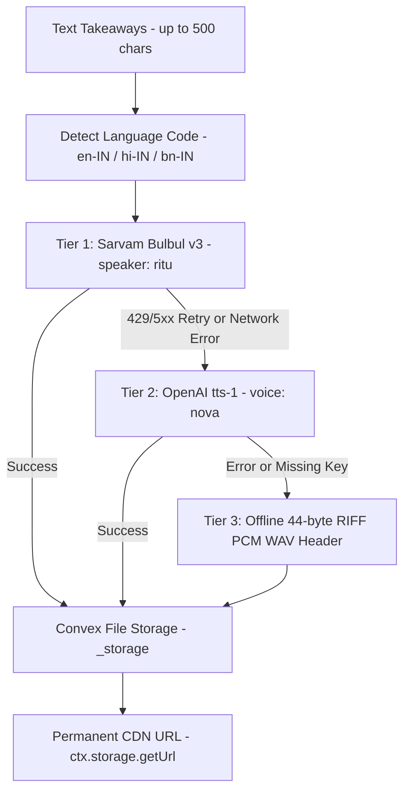

# Audio Generation & TTS

Moitrii provides synthesized audio narration for every published lifestyle guide. The audio pipeline is engineered with a **multi-tier fallback cascade** to ensure audio artifacts are always generated and stored in Convex File Storage without blocking agent execution or failing scheduled wake workflows.

## Voice Persona & Brand Identity

Because Moitrii is an AI companion designed specifically for modern Indian women, the primary synthetic narration uses **Sarvam AI Bulbul v3** with female speaker voice `ritu`. This voice delivers natural cadence, warm prosody, and authentic pacing across English and regional Indic languages.

## Architecture & Cascade Overview



## Cascade Tiers

### Tier 1: Primary — Sarvam AI Bulbul v3

- **Model:** `bulbul:v3`
- **Voice / Speaker:** `ritu` (female voice tailored for modern women's lifestyle companion)
- **Endpoint:** `https://api.sarvam.ai/text-to-speech`
- **Auth Header:** `api-subscription-key: <SARVAM_API_KEY>`
- **Language Mapping:**
  - `en` or `en-IN` ➔ `en-IN`
  - `hi` or `hi-IN` ➔ `hi-IN`
  - `bn` or `bn-IN` ➔ `bn-IN`
- **Input Text:** Summary of article key takeaways trimmed gracefully to sentence boundaries within 500 characters.
- **Fail-Fast Policy:** Client errors (400, 401, 403, 404) fail fast to avoid useless retries; transient server/rate errors (429, 5xx) retry up to 2 attempts before escalating to Tier 2.

### Tier 2: Secondary — OpenAI `tts-1`

- **Model:** `tts-1`
- **Voice:** `nova` (warm female voice)
- **Endpoint:** `https://api.openai.com/v1/audio/speech`
- **Auth Header:** `Authorization: Bearer <OPENAI_API_KEY>`
- **Behavior:** Fires automatically if `SARVAM_API_KEY` is not present or if Sarvam encounters network timeouts or rate limits.

### Tier 3: Offline Resilient WAV Persistence

- **Payload:** 44-byte standard RIFF PCM mono WAV audio header (`44.1 kHz`, `16-bit`, `PCM`).
- **Purpose:** Guarantees that every article published in demo mode, local development, or offline testing environments receives a valid, persisted `audioStorageId` in Convex `_storage`.
- **Zero Downtime:** The workflow step never throws an uncaught exception, maintaining complete pipeline determinism.

## Internal Key Resolution

API credentials are never passed from client requests. `generateAndStoreAudioNarration` reads backend environment variables internally:

```ts
const sarvamApiKey = overrideKeys?.sarvamKey || process.env.SARVAM_API_KEY;
const openAiKey = overrideKeys?.openAiKey || process.env.OPENAI_API_KEY;
```

## Frontend Audio Player

The frontend reader view (`src/pages/ContentReaderPage.tsx`) renders a dedicated in-article audio player bar directly below the article header:

1. **Active Audio:** When `audioUrl` is present, renders an interactive HTML5 audio player with play/pause controls, progress scrubber, and volume slider.
2. **Disabled State:** When audio is unavailable, displays a calm lifestyle notice indicating text-only mode without breaking page layout.
