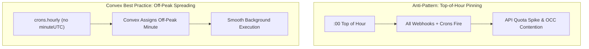
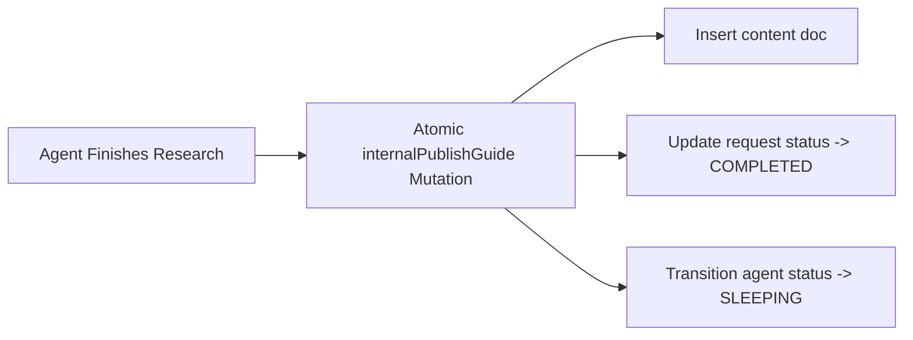
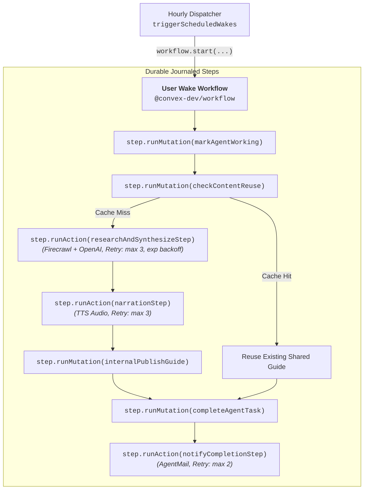

# Convex Best Practices & Architecture Patterns

Moitrii leverages Convex Cloud as an all-in-one reactive backend. This guide details the core Convex best practices and architectural patterns implemented across our database, functions, schedulers, and auth layer.

---

## 1. Cron Scheduling & Top-of-the-Hour Evasion

### The Problem: Top-of-Hour Contention
The top of the hour (`:00`) is universally the busiest minute across cloud services. Inbound webhooks, external client traffic, automated cron jobs, and batch syncs all fire simultaneously at minute `0`, resulting in:
- High contention on database transactions (OCC retries).
- Third-party API rate limiting (OpenAI, Brevo, AgentMail).
- Webhook delivery delays.

### The Solution: `crons.hourly` Without `minuteUTC`
In `convex/crons.ts`, Moitrii schedules the autonomous agent wake evaluator using `crons.hourly` with `minuteUTC` omitted:

```typescript
import { cronJobs } from "convex/server";
import { internal } from "./_generated/api";

const crons = cronJobs();

/**
 * Autonomous hourly cron job that evaluates due wake cycles.
 * Omits minuteUTC so Convex automatically selects an off-peak minute
 * and spreads execution across the hour away from the top of the hour.
 */
crons.hourly(
  "autonomous-agent-wake-cycle",
  {},
  internal.agentRunner.triggerScheduledWakes,
  {}
);

export default crons;
```



> [!TIP]
> The `@convex-dev/no-top-of-hour-crons` rule flags schedules pinned to minute 0. Always omit `minuteUTC` or choose a dedicated off-peak minute (e.g., `:23`, `:37`) for recurring batch workloads.

---

## 2. Clock-Agnostic Queries & Time Invariance

### Pure Queries Without Wall Clocks
Convex queries are cached and reactive. Reading `Date.now()` or `new Date()` inside a query breaks caching determinism and causes queries to become stale because time advancing does not invalidate reactive query caches.

### Moitrii Implementation
- Queries accept timestamps as explicit arguments (e.g., `nowMs: v.optional(v.number())` or `nowIso: v.string()`).
- Background **actions** and client hooks generate timestamps and pass them down:

```typescript
// convex/requests.ts
export const listUserRequests = query({
  args: {
    nowMs: v.optional(v.number()),
  },
  handler: async (ctx, args) => {
    const userId = await getAuthUserId(ctx);
    if (!userId) return [];

    const cutoff = args.nowMs;
    const requests = await ctx.db
      .query("requests")
      .withIndex("by_user", (q) => q.eq("userId", userId))
      .order("desc")
      .collect();

    // Pure, deterministic filter without internal Date.now() calls
    if (cutoff !== undefined) {
      return requests.filter((r) => r.expiresAt === undefined || r.expiresAt > cutoff);
    }
    return requests;
  },
});
```

---

## 3. Atomic Mutations & Database OCC Transactions

### 1-Step Publishing Over Multi-Step Storage Flows
When publishing research guides or agent deliverables, Moitrii writes the markdown guide, takeaways, category, author metadata, and audio attachment atomically in a single mutation (`content.internalPublishGuide`).



### Self-Healing & Error Rollback
If the OpenAI synthesis, TTS generation, or email dispatch encounters an unexpected error, the runner invokes `revertAgentWorking` to atomically revert the agent to `SLEEPING` and queued requests to `PENDING`, guaranteeing zero stranded tasks.

---

## 4. Index Optimization & Bounded Query Projections

### Table Indexes Over Table Scans
Every frequently queried path in Moitrii uses targeted compound indexes:

| Table | Index | Purpose |
|---|---|---|
| `content` | `by_reused_count` | Trending articles sorted by reuse frequency |
| `content` | `by_category` | Category filtering in Explore streams |
| `requests` | `by_status` | Finding `PENDING` requests during wake cycles |
| `requests` | `by_user` | User request center and history |
| `requests` | `by_user_and_status` | Fast point-lookup for pending request limit checks |
| `agents` | `by_user` | 1:1 user-to-agent mapping |
| `userInterests` | `by_user` | Fast user preferences retrieval |

```typescript
// convex/content.ts
export const getWhatsHot = query({
  args: { limit: v.optional(v.number()) },
  handler: async (ctx, args) => {
    const limit = args.limit ?? 6;
    // Bounded projection over index, no full table scan
    return await ctx.db
      .query("content")
      .withIndex("by_reused_count")
      .order("desc")
      .take(limit);
  },
});
```

---

## 5. Durable Workflows via `@convex-dev/workflow`

### Multi-Step Agent Pipelines with Journaled Steps
Autonomous agent execution involves multi-step async operations (Firecrawl web research, LLM synthesis, TTS audio generation, shared library publishing, and AgentMail dispatch). Moitrii orchestrates these via `@convex-dev/workflow`:



- **Step Journaling:** Completed steps are recorded in the component log. Replays skip completed steps, preventing duplicate LLM calls or duplicate audio generation.
- **Per-Step Retry Policies:** Action steps configure granular exponential backoff retries (`maxAttempts: 3, initialBackoffMs: 1000, base: 2`).
- **Isolated User Blast Radius:** Each user's wake workflow executes in total isolation without blocking other users.

---

## 6. 5-Message Pending Queue Cap & Compound Indexing

To prevent unbounded queue growth and protect LLM budgets, Moitrii caps active pending requests to 5 per user:

```typescript
// convex/requests.ts
export const MAX_PENDING_REQUESTS_PER_USER = 5;

const pendingList = await ctx.db
  .query("requests")
  .withIndex("by_user_and_status", (q) =>
    q.eq("userId", userId).eq("status", "PENDING")
  )
  .take(MAX_PENDING_REQUESTS_PER_USER + 1);

if (pendingList.length >= MAX_PENDING_REQUESTS_PER_USER) {
  throw new Error("Queue limit reached: You can have at most 5 pending research requests.");
}
```

By leveraging the compound index `by_user_and_status` (`["userId", "status"]`), the validation is an $O(1)$ point-lookup reading at most 6 documents rather than scanning the user's full request history.

---

## 7. Convex TTL: 3-Day Data Retention & Scheduled Batch Cleanup

While Convex does not have silent engine-level row expiration, Moitrii implements transactional TTL using:
1. **Query-Time Filter:** Requests store `expiresAt = Date.now() + (3 * 24 * 60 * 60 * 1000)`. Queries filter active items where `expiresAt > cutoffMs`, making expired records immediately invisible.
2. **Daily Retention Cron:** A 24-hour interval cron executes `cleanupExpiredRequests` to purge expired documents in bounded `.take(100)` batches:

```typescript
// convex/crons.ts
crons.interval(
  "daily-todo-retention-cleanup",
  { hours: 24 },
  internal.requests.cleanupExpiredRequests,
  {}
);
```

---

## 8. Live Web Search & Grounding via Firecrawl

Moitrii integrates Firecrawl (`https://api.firecrawl.dev/v1/search`) as the agent's web research tool:
- **Top-Level Limit Specification:** Requests `limit: 3` directly in the Firecrawl search payload.
- **Citation Grounding:** Synthesized articles include verified source URLs directly in `sources`.
- **Honest Offline Fallback:** When API keys are unset (local development and automated Vitest suites), returns curated editorial references (`Moitrii Editorial Guidelines (Offline Reference)` with `https://moitrii.ai`), ensuring 100% test suite reliability without synthetic hallucinations.

---

## 9. Strict PII Protection & Zero-Leakage Data Model

To ensure member privacy:
- The `agents` table stores only persona identities (`"Moitrii Companion"`) and virtual inbox handles (`agent-<userId>@agentmail.to`).
- Zero human personal information (names, personal emails, payment data) is stored in the agent execution record.
- Authentication data is isolated strictly in the `@convex-dev/auth` tables (`users`, `authAccounts`, `authSessions`).

---

## 10. Server-Validated Auth State

Client-side tokens in `localStorage` can become stale or orphaned (e.g., if a server session is revoked). 

Moitrii uses the `useValidatedAuth` custom hook, which treats a session as signed in **only after** the `users.viewer` query returns a valid user document from the Convex backend. If validation times out or resolves to null, the UI gracefully renders the signed-out state.
