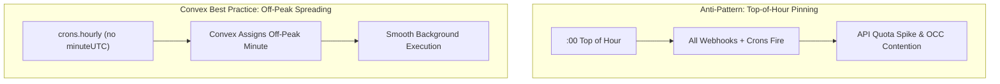
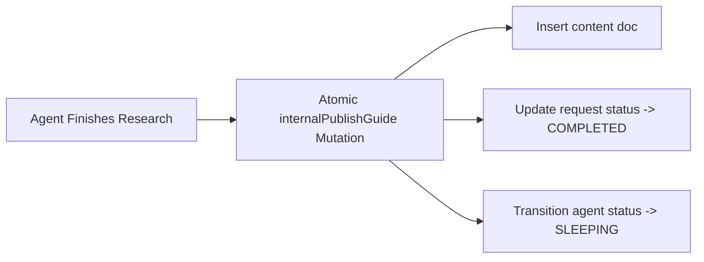

# Convex Best Practices & Architecture Patterns

Moitrii leverages Convex Cloud as an all-in-one reactive backend. This guide details the core Convex best practices and architectural patterns implemented across our database, functions, schedulers, and auth layer.

---

## 1. Cron Scheduling & Top-of-the-Hour Evasion

### The Problem: Top-of-Hour Contention
The top of the hour (`:00`) is universally the busiest minute across cloud services. Inbound webhooks, external client traffic, automated cron jobs, and batch syncs all fire simultaneously at minute `0`, resulting in:
- High contention on database transactions (OCC retries).
- Third-party API rate limiting (OpenAI, Brevo, AgentMail).
- Webhook delivery delays.

### The Solution: `crons.hourly` Without `minuteUTC`
In `convex/crons.ts`, Moitrii schedules the autonomous agent wake evaluator using `crons.hourly` with `minuteUTC` omitted:

```typescript
import { cronJobs } from "convex/server";
import { internal } from "./_generated/api";

const crons = cronJobs();

/**
 * Autonomous hourly cron job that evaluates due wake cycles.
 * Omits minuteUTC so Convex automatically selects an off-peak minute
 * and spreads execution across the hour away from the top of the hour.
 */
crons.hourly(
  "autonomous-agent-wake-cycle",
  {},
  internal.agentRunner.triggerScheduledWakes,
  {}
);

export default crons;
```



> [!TIP]
> The `@convex-dev/no-top-of-hour-crons` rule flags schedules pinned to minute 0. Always omit `minuteUTC` or choose a dedicated off-peak minute (e.g., `:23`, `:37`) for recurring batch workloads.

---

## 2. Clock-Agnostic Queries & Time Invariance

### Pure Queries Without Wall Clocks
Convex queries are cached and reactive. Reading `Date.now()` or `new Date()` inside a query breaks caching determinism and causes queries to become stale because time advancing does not invalidate reactive query caches.

### Moitrii Implementation
- Queries accept timestamps as explicit arguments (e.g., `nowIso: v.string()`).
- Background **actions** (which can freely read wall clocks) generate the timestamp and pass it down to internal queries:

```typescript
// convex/agentRunner.ts
export const triggerScheduledWakes = internalAction({
  args: { targetUserId: v.optional(v.string()) },
  handler: async (ctx, args) => {
    // Actions read the wall clock; queries receive it as a pure parameter
    const dueAgents = await ctx.runQuery(
      internal.agentRunner.getDueAgentsWithRequests,
      { nowIso: new Date().toISOString() }
    );
    // ...
  },
});
```

---

## 3. Atomic Mutations & Database OCC Transactions

### 1-Step Publishing Over Multi-Step Storage Flows
When publishing research guides or agent deliverables, Moitrii writes the markdown guide, takeaways, category, author metadata, and audio attachment atomically in a single mutation (`content.internalPublishGuide`).



### Self-Healing & Error Rollback
If the OpenAI synthesis, TTS generation, or email dispatch encounters an unexpected error, the runner invokes `revertAgentWorking` to atomically revert the agent to `SLEEPING` and queued requests to `PENDING`, guaranteeing zero stranded tasks.

---

## 4. Index Optimization & Bounded Query Projections

### Table Indexes Over Table Scans
Every frequently queried path in Moitrii uses targeted compound indexes:

| Table | Index | Purpose |
|---|---|---|
| `content` | `by_reused_count` | Trending articles sorted by reuse frequency |
| `content` | `by_category` | Category filtering in Explore streams |
| `requests` | `by_status` | Finding `PENDING` requests during wake cycles |
| `requests` | `by_user` | User request center and history |
| `agents` | `by_user` | 1:1 user-to-agent mapping |
| `userInterests` | `by_user` | Fast user preferences retrieval |

```typescript
// convex/content.ts
export const getWhatsHot = query({
  args: { limit: v.optional(v.number()) },
  handler: async (ctx, args) => {
    const limit = args.limit ?? 6;
    // Bounded projection over index, no full table scan
    return await ctx.db
      .query("content")
      .withIndex("by_reused_count")
      .order("desc")
      .take(limit);
  },
});
```

---

## 5. Strict PII Protection & Zero-Leakage Data Model

To ensure member privacy:
- The `agents` table stores only persona identities (`"Moitrii Companion"`) and virtual inbox handles (`agent-<userId>@agentmail.to`).
- Zero human personal information (names, personal emails, payment data) is stored in the agent execution record.
- Authentication data is isolated strictly in the `@convex-dev/auth` tables (`users`, `authAccounts`, `authSessions`).

---

## 6. Server-Validated Auth State

Client-side tokens in `localStorage` can become stale or orphaned (e.g., if a server session is revoked). 

Moitrii uses the `useValidatedAuth` custom hook, which treats a session as signed in **only after** the `users.viewer` query returns a valid user document from the Convex backend. If validation times out or resolves to null, the UI gracefully renders the signed-out state.
