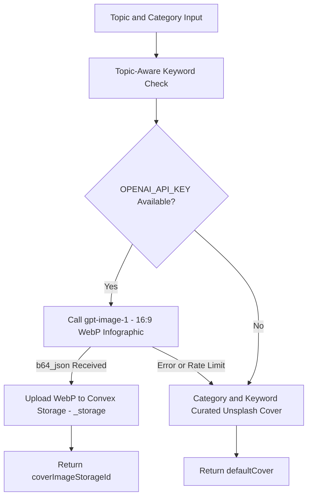

# Infographic Cover Generation

Moitrii features a dedicated visual cover generation engine (`convex/ai/imagegen.ts`) that produces editorial, horizontal landscape infographic posters for research deliverables and published guides.

## Core Design Principles

Unlike generic AI art generators that produce cluttered illustrations with garbled text, Moitrii enforces strict visual constraints tailored for a calm, editorial lifestyle magazine aesthetic:



## Prompt Engineering & Invariants

The prompt template `INFOGRAPHIC_PROMPT_TEMPLATE` and builder `buildInfographicPrompt` reside in `convex/ai/imagePrompts.ts` and enforce the following invariants:

### 1. 16:9 Horizontal Landscape Layout
- Designed as wide editorial banners (`1536x1024`) that fit hero card containers across desktop and mobile screens.
- Arranged with balanced infographic blocks stacked horizontally.

### 2. Strictly Zero-Text Rule (with Watermark Exception)
- **100% Visual Depiction:** The model is strictly instructed to omit all typography, words, letters, labels, or captions in the graphics.
- **Watermark (Sole Text Exception):** A subtle, semi-transparent `"Moitrii"` watermark is placed diagonally near the bottom-right corner.

### 3. Family-Safe & Respectful Lifestyle Ethics
- Strictly prohibits vulgarity, nudity, suggestive content, and socially or morally abusive depictions.
- Celebrates wellness, mindfulness, nutrition, family living, home beauty, and balanced daily rituals.

## Model Configuration

Image generation connects to the OpenAI image generation API using `gpt-image-1` with WebP compression and low-cost settings:

```ts
const response = await fetch("https://api.openai.com/v1/images/generations", {
  method: "POST",
  headers: {
    "Content-Type": "application/json",
    Authorization: `Bearer ${effectiveKey}`,
  },
  body: JSON.stringify({
    model: "gpt-image-1",
    prompt: promptText,
    size: "1536x1024",
    quality: "low",
    output_format: "webp",
    output_compression: 80,
    n: 1,
  }),
});
```

## Storage & CDN URL Resolution

1. **WebP Compression & Storage Persistence:** Generated `b64_json` is converted into a lightweight `image/webp` binary `Blob` and stored directly in **Convex File Storage (`_storage`)**. WebP compression reduces storage byte overhead by over 70% compared to raw PNG.
2. **Dynamic URL Resolution:** Convex database queries (`getContentBySlug`, `getPublishedContent`, `getWhatsHot`) resolve permanent CDN URLs via `ctx.storage.getUrl(doc.coverImageStorageId)`.
3. **Database URL Stabilization:** The database document stores a permanent fallback URL in `doc.coverImage` alongside `doc.coverImageStorageId`, preventing perishable signed URLs from expiring.

## Curated Fallback Matrix

When running offline or if API rate limits occur, `getKeywordUnsplashCover(topic, category)` dynamically inspects topic keywords and category tags to return high-resolution curated photography:

| Topic / Category Keywords | Curated Unsplash Asset |
| :--- | :--- |
| `food`, `recipe`, `tea`, `cooking`, `diet`, `drink` | Balanced organic culinary and nutrition photography |
| `beauty`, `skin`, `hair`, `makeup`, `glow` | Calm holistic skincare and botanical aesthetics |
| `travel`, `trip`, `vacation`, `destination` | Serene travel landscapes |
| `health`, `fitness`, `workout`, `kadha`, `ayurveda` | Yoga, breathwork, and mindful movement |
| `home`, `decor`, `living`, `garden` | Warm interior design and organized living |
| `parenting`, `kid`, `child`, `baby` | Warm family moments and mindful parenting |
| `wellness` / `default` | Meditative and peaceful lifestyle compositions |
