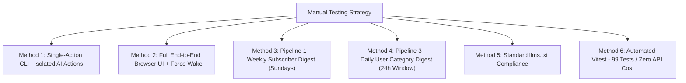

# Manual Testing & Verification

This guide outlines quick methods for developers and reviewers to manually exercise the Moitrii platform — from single-action CLI runs to full end-to-end workflow execution in the browser.



---

## Method 1: Instant Isolated CLI Actions (10 Seconds)

You can run individual pipeline actions directly from your terminal using `npx convex run` without waiting for scheduled cron triggers:

### 1. Test `gpt-image-1` WebP Infographic Generation

**Bash / macOS / Linux / PowerShell:**
```bash
npx convex run agentRunner:imageGenStep '{"topic":"Morning Herbal Turmeric Tea Ritual","category":"wellness"}'
```

**Windows DOS Command Prompt (`cmd.exe`):**
```cmd
npx convex run agentRunner:imageGenStep "{\"topic\":\"Morning Herbal Turmeric Tea Ritual\",\"category\":\"wellness\"}"
```
- **What it does:** Generates a 16:9 horizontal landscape WebP infographic banner (`1536x1024`, `quality: low`, `output_compression: 80`) with a subtle `"Moitrii"` watermark.
- **Expected Return:** `{ coverImage: "https://images.unsplash.com/...", coverImageStorageId: "<storage_id>" }`.
- **Storage:** Binary is stored as `image/webp` in Convex File Storage (`_storage`).

---

### 2. Test Sarvam AI Bulbul v3 TTS Narration (`speaker: "ritu"`)

**Bash / macOS / Linux / PowerShell:**
```bash
npx convex run agentRunner:narrationStep '{"text":"Start with warm water and fresh herbs. Practice ten minutes of morning silence for restorative focus.","language":"en"}'
```

**Windows DOS Command Prompt (`cmd.exe`):**
```cmd
npx convex run agentRunner:narrationStep "{\"text\":\"Start with warm water and fresh herbs. Practice ten minutes of morning silence for restorative focus.\",\"language\":\"en\"}"
```
- **What it does:** Generates audio narration using Sarvam AI Bulbul v3 with female voice `ritu` (tailored for Moitrii's women lifestyle companion), trimmed to sentence boundaries within 500 characters.
- **Expected Return:** `{ audioUrl: "https://...", audioStorageId: "<storage_id>" }`.

---

### 3. Test `gpt-5.6-luna` 500+ Word Text Synthesis

**Bash / macOS / Linux / PowerShell:**
```bash
npx convex run agentRunner:researchAndSynthesizeStep '{"prompt":"Ayurvedic evening milk for deep restorative sleep","category":"wellness","language":"en"}'
```

**Windows DOS Command Prompt (`cmd.exe`):**
```cmd
npx convex run agentRunner:researchAndSynthesizeStep "{\"prompt\":\"Ayurvedic evening milk for deep restorative sleep\",\"category\":\"wellness\",\"language\":\"en\"}"
```
- **What it does:** Calls `gpt-5.6-luna` with structured JSON format, performing live web search via Firecrawl, formatting 4 takeaways, verified sources, and an in-depth 500+ word markdown guide.
- **Expected Return:** Complete `SynthesizedGuide` object.

---

## Method 2: Full End-to-End Workflow & Browser UI Test

Experience the entire user flow from prompt submission to reading the published article in the browser:

### 1. Boot Local Development Servers
```bash
# Terminal 1: Frontend SPA
npm run dev

# Terminal 2: Convex Backend Watcher
npx convex dev
```

### 2. Submit a Research Request in the UI
1. Open [http://localhost:3000/dashboard](http://localhost:3000/dashboard) (or [http://localhost:3000/requests](http://localhost:3000/requests)).
2. In the **Quick Request box**, enter a prompt (e.g., *"Natural skincare remedies for monsoon humidity"*).
3. Click submit — the prompt appears in your request list with badge `PENDING`.

### 3. Trigger Instant Wake Execution

In your terminal, execute the force-wake dispatcher:

**Bash / macOS / Linux / PowerShell:**
```bash
npx convex run agentRunner:triggerScheduledWakes '{"force":true}'
```

**Windows DOS Command Prompt (`cmd.exe`):**
```cmd
npx convex run agentRunner:triggerScheduledWakes "{\"force\":true}"
```

### 4. Verify Live Deliverable
1. Watch the dashboard request status transition reactively: `PENDING` ➔ `PROCESSING` ➔ `COMPLETED`.
2. Click **"Ready to read →"** or open the deliverable link (`/content/:slug`).
3. On the article reader page, verify:
   - **16:9 WebP Infographic:** Visual header at the top of the article.
   - **Audio Narration Player:** Interactive playback bar with play/pause and progress scrubber directly below the title.
   - **500+ Word Guide:** Rich multi-section markdown synthesized by `gpt-5.6-luna`.
   - **Video Companion:** Curated YouTube video player embedded in the article.

---

## Method 3: Pipeline 1 — Weekly Subscriber Digest (Sundays)

Test the zero-LLM Sunday newsletter engine and one-click unsubscribe flow:

### 1. Trigger the Digest Dispatcher
```bash
npx convex run subscribers:dispatchWeeklyDigestCron
```
- Queries top 10 articles by `reusedCount` (descending) with stored takeaways.
- Sends broadcast to active subscribers via Brevo (or logs delivery in mock mode if API key is unset).

### 2. Verify Unsubscribe Status

**Bash / macOS / Linux / PowerShell:**
```bash
npx convex run subscribers:getSubscriberStatus '{"email":"your-email@example.com"}'
```

**Windows DOS Command Prompt (`cmd.exe`):**
```cmd
npx convex run subscribers:getSubscriberStatus "{\"email\":\"your-email@example.com\"}"
```
- Returns `{ isSubscribed: true, status: "ACTIVE" }` or `{ isSubscribed: false, status: "UNSUBSCRIBED" }`.

---

## Method 4: Pipeline 3 — Daily User Category Digest (Strict 24h & Top 5)

Test the automated daily personalized digest delivered to registered users based on their opted topic preferences:

### 1. Trigger the Daily User Category Digest

**Bash / macOS / Linux / PowerShell:**
```bash
# Default: collect articles from the last 24 hours
npx convex run userDigests:triggerUserDailyDigestManual

# Custom window: collect articles from the last 48 hours for testing
npx convex run userDigests:triggerUserDailyDigestManual '{"sinceHours":48}'
```

**Windows DOS Command Prompt (`cmd.exe`):**
```cmd
npx convex run userDigests:triggerUserDailyDigestManual "{\"sinceHours\":48}"
```

- **What it does:**
  1. Filters published articles strictly for `publishedAt >= cutoffIso` (e.g. last 24 hours).
  2. Groups articles by category and takes strictly the **top 5 articles** per category (sorted by `reusedCount` descending).
  3. Queries all active users and their selected `topicIds` (from `userInterests`).
  4. Matches user preferences against 24h categories; skips users who have 0 new articles published in their chosen categories.
  5. Renders a category-sectioned editorial HTML email (`renderUserDailyDigestHtml`) and dispatches via Brevo (`sendUserDailyDigestEmail`).
- **Expected Return:**
  ```json
  {
    "totalUsers": 2,
    "sentCount": 2,
    "skippedCount": 0,
    "categoriesCount": 3
  }
  ```

---

## Method 5: Standard `llms.txt` Compliance

Verify that AI search agents and LLM web crawlers can parse the site's manifest without audit errors:

### 1. Verify Static Frontend Route
```bash
curl -I http://localhost:3000/llms.txt
```
- Returns HTTP `200 OK` with `Content-Type: text/plain`.

### 2. Verify Backend HTTP Router Route
```bash
curl http://localhost:3000/llms.txt
```
- **Audit Verification:**
  - Starts with required H1 title: `# Moitrii`.
  - Includes summary blockquote: `> An intentional, calm AI companion...`.
  - Contains structured markdown links pointing to core routes (`/explore`, `/dashboard`, `/onboarding`, `/publisher`, `/docs/**`).

---

## Method 6: Zero-Cost Automated Vitest Suite (Offline)

Verify the entire test suite across UI components and Convex functions without spending API credits or network bandwidth:

```bash
npm test
```

- **UI Tests (`src/**/*.test.tsx`):** JSDOM environment testing auth state, routing, and component interactions.
- **Convex Tests (`convex/**/*.test.ts`):** Edge runtime testing schema rules, compound indexes, request persistence, multi-tier fallback cascades, 24h category digest filtering, and workflow executions (93 passing tests).
