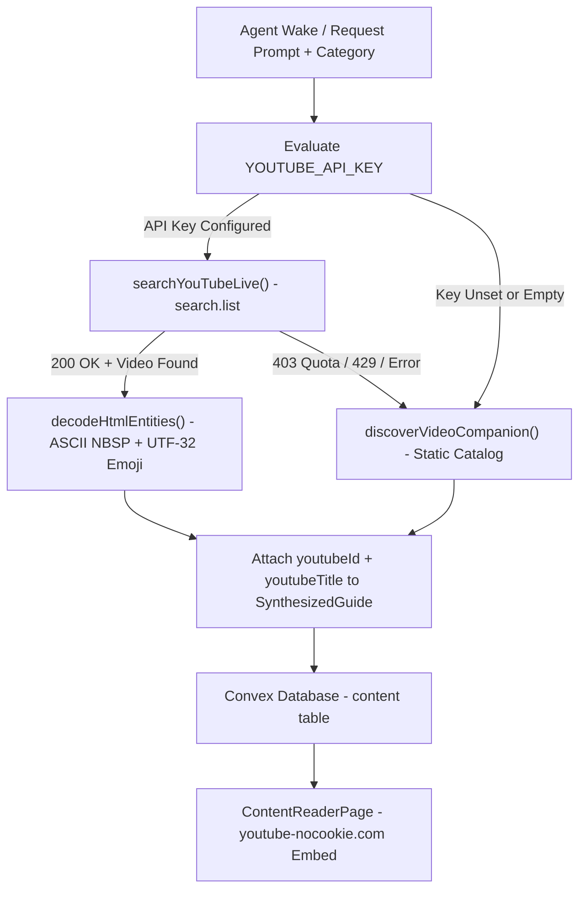

# YouTube Recommender & Data API v3

Moitrii enriches every synthesized lifestyle guide with a curated, relevant video companion. The engine combines **live YouTube Data API v3 search** with a **deterministic offline lifestyle catalog** to ensure 100% pipeline reliability and policy-compliant, privacy-enhanced video embedding.

---

## Architecture & Resolution Flow



---

## 1. YouTube Data API v3 Parameters & Policy Compliance

When `process.env.YOUTUBE_API_KEY` is present in Convex Cloud environment variables, the engine executes a targeted query against the official `search.list` endpoint with strict parameter constraints:

```http
GET https://www.googleapis.com/youtube/v3/search?part=snippet&type=video&videoEmbeddable=true&videoSyndicated=true&safeSearch=moderate&order=relevance&maxResults=1&q={query}&key={YOUTUBE_API_KEY}
```

### Parameter Rationale:
- **`part=snippet`**: Retrieves essential video metadata (ID, title, description, and channel title).
- **`type=video`**: Limits search strictly to video items, excluding channels and playlists.
- **`videoEmbeddable=true`**: Eliminates YouTube embed errors 150/101 by filtering out videos that restrict third-party embedding.
- **`videoSyndicated=true`**: Ensures video content is licensed for playback outside youtube.com.
- **`safeSearch=moderate`**: Enforces family-friendly lifestyle content aligned with Moitrii's editorial standards.
- **`order=relevance`**: Surfaces the most pertinent video companion matching the article topic.
- **`maxResults=1`**: Token & quota efficient (1 search = 100 quota units).

---

## 2. Entity & Astral Plane Emoji Normalization

YouTube API responses return HTML entity-encoded snippet titles (e.g. `&amp;`, `&#39;`, `&#160;`, `&#128512;`).

The `decodeHtmlEntities` function normalizes:
- **Named Entities**: `&amp;` ➔ `&`, `&quot;` ➔ `"`, `&#39;` / `&apos;` ➔ `'`, `&lt;` ➔ `<`, `&gt;` ➔ `>`.
- **NBSP Whitespace**: Normalizes decimal `&#160;` and hex `&#xA0;` to standard ASCII space (`" "`) to prevent string matching failures.
- **Astral Plane Emojis**: Uses `String.fromCodePoint` to safely decode multi-byte emojis (e.g. `&#128512;` ➔ 😀, `&#x1F33F;` ➔ 🌿) without 16-bit truncation.

---

## 3. Deterministic Zero-Downtime Fallback Catalog

If:
1. `YOUTUBE_API_KEY` is not set (e.g. local offline dev or testing),
2. YouTube API daily quota (10,000 units/day default) is exhausted (HTTP 403), or
3. A network abort/timeout occurs (5-second timeout threshold),

The engine seamlessly degrades to `discoverVideoCompanion`, matching keyword regexes (`TOPIC_RULES`) and category defaults (`CURATED_COMPANIONS`). This ensures the agent runner workflow never throws uncaught exceptions or fails article delivery.

---

## 4. Privacy-Enhanced Embeds & Legal Compliance

### Player Embedding
All embedded videos in the reader interface use Google's privacy-enhanced domain:
```html
<iframe
  src="https://www.youtube-nocookie.com/embed/{cleanVideoId}"
  title="{youtubeTitle}"
  allow="accelerometer; autoplay; clipboard-write; encrypted-media; gyroscope; picture-in-picture"
  allowFullScreen
  className="w-full h-full border-0"
/>
```

### Direct Fallback & Attribution
Every embedded video companion includes:
- Uncropped, unobstructed 16:9 responsive aspect ratio.
- Direct **"Watch on YouTube"** link (`https://www.youtube.com/watch?v={cleanVideoId}`).
- Clear channel and video title attribution.

### Footer Disclosures
The application footer includes explicit legal disclosures and links:
- [YouTube Terms of Service](https://www.youtube.com/t/terms)
- [Google Privacy Policy](https://policies.google.com/privacy)
